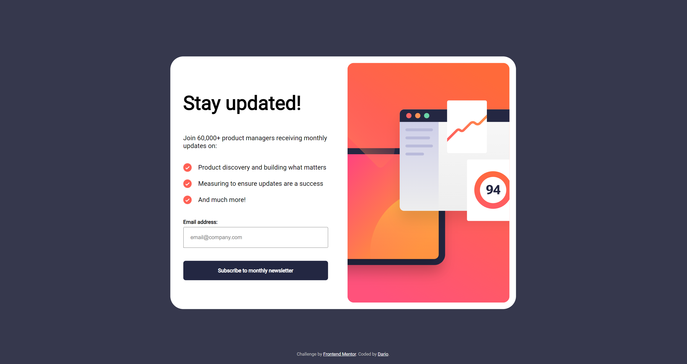
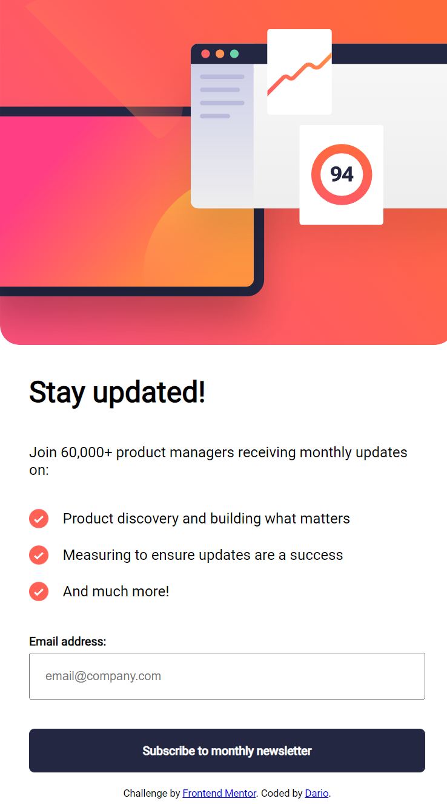

# Frontend Mentor - Newsletter sign-up form with success message solution

This is a solution to the [Newsletter sign-up form with success message challenge on Frontend Mentor](https://www.frontendmentor.io/challenges/newsletter-signup-form-with-success-message-3FC1AZbNrv). challenge. It was quite instructional.

## Table of contents

- [Overview](#overview)
  - [The challenge](#the-challenge)
  - [Screenshot](#screenshot)
  - [Links](#links)
- [My process](#my-process)
  - [Built with](#built-with)
  - [What I learned](#what-i-learned)
  - [Continued development](#continued-development)
  - [Useful resources](#useful-resources)

**Note: Delete this note and update the table of contents based on what sections you keep.**

## Overview

### The challenge

Users should be able to:

- Add their email and submit the form
- See a success message with their email after successfully submitting the form
- See form validation messages if:
  - The field is left empty
  - The email address is not formatted correctly
- View the optimal layout for the interface depending on their device's screen size
- See hover and focus states for all interactive elements on the page

### Screenshot
## Desktop

## Mobile

### Links

- [Live site URL](https://dariorubenscanferlato.github.io/frontend-practice/)

## My process

### Built with

- Semantic HTML5 markup
- CSS custom properties
- Flexbox
- Mobile-first workflow

### What I learned

- @media (min-width: 750px) can be used in .css to have custom properties for larger screens
- Be careful in .css when stilying default tags a dot should not be used (e.g. body instead of .body)
- margin: auto auto; is very cool
- position: fixed, absolute can be useful, especially if used with transform: translate(-50%, -50%);

## Stuff to memorize
- Add  at the end
- <link rel="stylesheet" href="index.css"> to add .css
- const imgElement = document.getElementById('dynamicImg');
- const emailForm = document.querySelector('.emailform');

### Useful resources

- [Flexbox reference](https://css-tricks.com/snippets/css/a-guide-to-flexbox/)<
